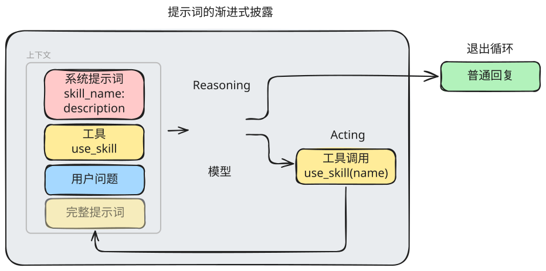
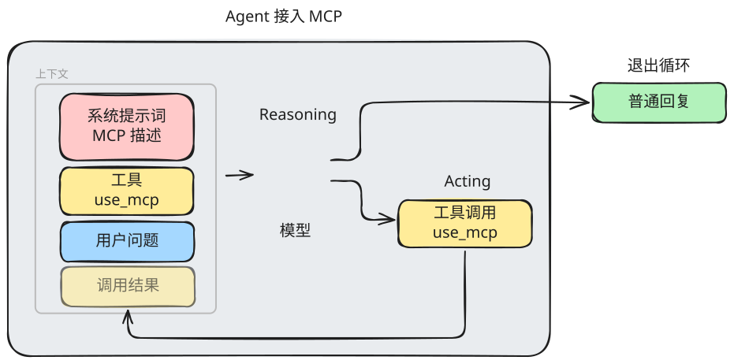
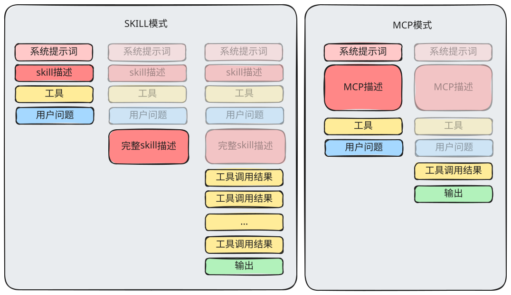

# SKILL VS MCP

Skill 和 MCP 完全是两个东西，它们之所以放到一起讨论，是因为在使用感官上，它们有一些共同点。

## 共同点

### 标准化

无论是 Skill 还是 MCP，它们都有各自的事实标准。

由于有标准，就容易形成社区和聚合站。我们通过社区或聚合站，能使用到大量现成的 SKILL 和 MCP 工具。

### 功能体验重叠

以获取某个城市的天气为例，它既可以用Skill来实现，也可以使用 MCP 来实现。

## 差异点

定位差异：MCP 告诉模型谁来做，Skill 告诉模型怎么做

|                      | Skill | MCP                       |
| -------------------- | ----- | ------------------------- |
| 上下文消耗（未命中） | 低    | 高 *可通过渐进式披露解决* |
| 上下文消耗（命中）   | 高    | 低                        |
| 接入成本             | 低    | 高                        |
| 可扩展性             | 高    | 低                        |
| 贡献人群             | 广    | 窄                        |
| 确定性               | 低    | 高                        |
| 通用工具依赖         | 高    | 低                        |
| 越权风险             | 高    | 低                        |

## 最佳实践

MCP 定义底层工具，Skill 定义业务流程

MCP 负责实现底层工具：

- 文件读写
- 命令执行
- 网络搜索
- 接口搜索、调用
- 代码执行
- 其他对确定性、安全性要求高的操作

Skill 负责定义业务流程：

- 机票怎么定，行程怎么规划
- 退货能不能退，怎么退
- 怎么介绍产品
- 怎么成交
- 其他对灵活性、专业性要求高的流程
