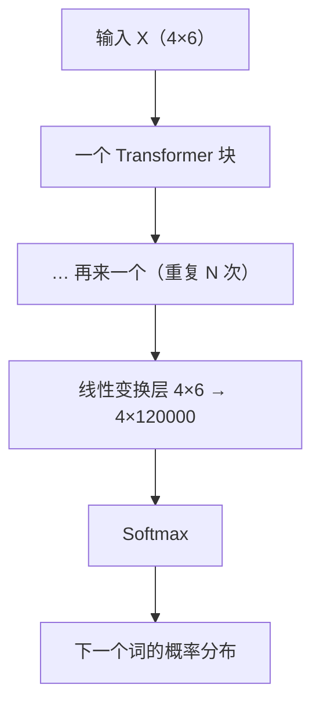

上一讲 [[【基础】注意力机制]] 只讲了一件事：让每个词"看看上下文、按亲疏吸收信息、更新自己"。可那只是**一整层运算里的一小步**。这一讲把整个模型的前向训练流程串起来——注意力算完的 4×6 表，之后还要经过**残差、归一化、前馈网络**，打包成一个"块（Block）"；几十个块摞起来，末尾接一个"预测下一个词"的输出层，最后靠反向传播把这些参数都训练出来。

## 1. 一句话理解

**Transformer = 把"注意力 + 残差归一化 + 前馈网络"打包成一个块，重复堆叠几十次，最后接一个线性层 + softmax 输出"下一个词的概率"；训练时用真实语料里的"下一个词"当标签，反向传播调参数。**

## 2. 先看全貌

一句话进来，走完整条流水线：



- 中间那个"块"就是本篇的主角，里面有 6 个小步骤（下一节展开）；
- "重复 N 次"：N 就是层数，比如 DeepSeek V4 Pro 有 **61 个** Transformer 块；
- 末尾线性层把 6 维拉开到 **120000 维**（词表里有 12 万个"候选词"），再 softmax 成概率，谁概率大就预测谁。

> 大白话：一个块像一道"加工工序"，把 4×6 的表加工成一张"稍微更懂上下文"的 4×6 表；几十道工序接力，最后一张 4×6 表的每一行都浓缩了整句话的意思。

## 3. 一个块内部的六个步骤

单个 Transformer 块，接收一张 4×6 的表，输出一张 4×6 的表，中间走 6 步：

| 步骤 | 名称         | 干了什么                                                | 输出形状 |
| ---- | ------------ | ------------------------------------------------------- | -------- |
| 1    | 多头注意力   | 每个词看看上下文、互相参考（见 [[【基础】注意力机制]]） | 4×6      |
| 2    | 残差连接 Add | 把"注意力输出"和"块入口的输入"直接相加                  | 4×6      |
| 3    | 归一化 Norm  | 把数值压回正常范围（RMSNorm，大约到 [-3,3]）            | 4×6      |
| 4    | 前馈网络 FFN | 再加一层神经网络，提升复杂度、存"知识"                  | 4×6      |
| 5    | 残差连接 Add | 把 FFN 输出和它的输入相加                               | 4×6      |
| 6    | 归一化 Norm  | 再把数值压回正常范围                                    | 4×6      |

> 一个块 = **两次「子层 + 残差 + 归一化」**（先注意力、后前馈）。下面按顺序把这 6 步讲透：第 4 节复习第 1 步（注意力，上一讲细讲过，这里只补一句 RoPE），第 5 节讲第 2、3 步（残差 + 归一化），第 6 节讲第 4 步（前馈网络），第 7 节讲第 5、6 步（再来一遍残差 + 归一化）。

## 4. 多头注意力：复习一句 + 补上 RoPE

就是 [[【基础】注意力机制]] 那一整讲：$Q=XW^{Q},\,K=XW^{K},\,V=XW^{V}$，切多头，$\operatorname{softmax}\!\big(QK^{\top}/\sqrt{d_k}\big)V$，让每个词吸收上下文。

这一讲只补一个上一讲留的尾巴——**位置信息 RoPE**：

- 注意力本身"不分先后"（"咬苹果"和"苹果咬"算出来一样），所以现代大模型要在 Q、K 里塞进"我是第几个词"的记号；
- 这个记号算法叫**旋转位置编码 RoPE**；
- **注入时机**：多头切分之后、算注意力得分之前；**作用对象**：Q 和 K 两个矩阵。

> 大白话：RoPE 就像给每个词盖了个"第几名"的章，让模型知道谁在前谁在后，又不破坏注意力的并行计算。

## 5. 残差连接 + 归一化

注意力层输出的 4×6 表，还不能直接往下传：数值可能变大、变散，信息也可能在几十层深处丢失。所以紧跟两个"稳定器"——**残差**（第 2 步）和**归一化**（第 3 步）。

### 5.1 残差连接（Add）：给信息开一条"直通道"

把**注意力层的输出，和进入注意力层之前的原始输入，直接相加**：

$$
X_{\text{out}} = X_{\text{in}} + \operatorname{Attention}(X_{\text{in}})
$$

- 如果注意力层"什么都没学出来"（输出接近 0），那这一层就等于原样把输入传过去，**至少不退步**；
- 训练时梯度也能顺着这条"直通道"一路往回传，不容易在几十层深的地方**消失**。

> 大白话：残差连接 = 给每一层**开了条"抄近道"的旁路**。主路负责学"新增的知识"，旁路负责把原样信息往前送。两路相加，就算主路一时没学到东西，信息也不会断。

### 5.2 归一化（Norm）：把数字拉回正常范围

加完残差，数值可能变大、变散。归一化把它们**重新压回一个稳定的小范围**。这一讲用的是 **RMSNorm（均方根归一化）**，核心就一步——用"每个词向量自己的大小"去把它自己按比例缩一缩：

$$
\operatorname{RMSNorm}(x) = \frac{x}{\sqrt{\dfrac{1}{d}\sum_{k=1}^{d}x_k^{2}}}
$$

- 分母：$x$ 里 $d$ 个数的**均方根**（先各自平方、求平均、再开根号），代表"这个向量整体有多长"；
- 分子除以这个"长度"，就把向量缩到"长度 ≈ 1"的尺度；
- 课件里的效果：大部分数值被归一到 **[-3, 3]** 这个区间。

**为什么要归一化？** 目的是**防止梯度爆炸和梯度消失**：

- 数值一层层乘下去，如果不控制，会越来越大（爆炸）或越来越小（消失）；
- 爆炸 → 参数一步跳飞，训练崩掉；消失 → 梯度趋近 0，学不动；
- 每层都归一化一次，相当于给数值"踩刹车、稳油门"，保证几十层堆下去还在正常量级。

> 大白话：归一化 = 每加工一步，就**把数字统一缩回"不大不小"的尺度**，让后面的层和反向传播的梯度都别跑飞。没有它，61 层堆起来早就爆炸或熄火了。

## 6. 前馈网络 FFN：加深度、存知识

注意力只负责"谁参考谁"，信息该怎么**加工提炼**，交给前馈网络（第 4 步）。它本质上是一层**全连接神经网络**（类似 [[【基础】前向传播]] 里的一层），作用有两个：

1. **提升复杂度、引入非线性**：注意力里的矩阵乘法基本是线性的；不引入非线性，几十层线性堆起来还是线性，等于只有一层。FFN 里放非线性激活函数，模型才能表达复杂规律。
2. **存储"知识"**：FFN 的权重矩阵里，**不同的行（神经元）相当于存着不同的"知识片段/模式模板"**。当模型看到某个特定上下文时，相关的 FFN 神经元被激活，吐出对应的知识。

不同大模型在这一层设计不一样：课件举例 **DeepSeek V4 Pro 在 FFN 里用了 MoE（混合专家模型）**——不是所有神经元每次都参与，而是按需激活其中一部分"专家"，又强又省算力。

> 大白话：注意力管"看谁"，FFN 管"看完之后动脑加工"。注意力解决"联系"，FFN 提供"深度和知识储备"。

## 7. 再来一次残差 + 归一化

FFN 输出后，再做一遍和前面一样的操作（第 5、6 步）：

- **Add**：$X_{\text{out}} = X_{\text{in}} + \operatorname{FFN}(X_{\text{in}})$——给 FFN 也开旁路；
- **Norm**：再 RMSNorm 一次，把数值压回 [-3,3]。

到此，**单个 Transformer 块全部完成**：它吃进一张 4×6，吐出一张 4×6，只是每一行都多裹了一层"上下文信息"。

## 8. 往上摞：一个块的输出，就是下一个块的输入

单块算完，把这张 4×6 交给**下一个块**，循环往复：

```text
 输入 4×6 → 块1 → 4×6 → 块2 → 4×6 → … → 块61 → 4×6
```

- 每过一块，每行（每个词）携带的**上下文信息就多一分**；
- 层数越多，模型越能捕捉深层规律，但也越贵、越难训——DeepSeek V4 Pro 有 61 块。

### 8.1 最后那个 4×6，每一行到底"代表"什么

这里要先纠正一个容易误会的说法。因为注意力里有**掩码**（见 [[【基础】注意力机制]] 第 6 节），每个词**只能看到自己左边的词**，所以准确讲：**第 $i$ 行代表"这个词 + 它左边所有词"构成的语境下，这个词的含义**——而不是"看到整个句子（含右边）"。

用例句 **"他 咬 了 苹果"**（4 个词）逐行看：

| 行（位置） | 这个词 | 掩码后能看到谁             | 这一行输出代表的含义                     | 训练时拿它预测谁   |
| ---------- | ------ | -------------------------- | ---------------------------------------- | ------------------ |
| 第 1 行    | 他     | 只有"他"                   | "他"在**句首**的含义                     | 下一个词"咬"       |
| 第 2 行    | 咬     | "他、咬"                   | 在"他"之后、这个"咬"（动作）的含义       | 下一个词"了"       |
| 第 3 行    | 了     | "他、咬、了"               | "他咬了"之后、这个"了"（完成态）的含义   | 下一个词"苹果"     |
| 第 4 行    | 苹果   | "他、咬、了、苹果"（全部） | "他咬了"之后、"苹果"的含义（被咬的食物） | 下一个词（如句号） |

看最后一行就明白了：**位置越靠后，能看到的"前缀"越长；最后一个词能看到整句话（它自己的全部左边）**。所以课件说"最后一个块的每一行表达了完整上下文"，指的是"**它所能看到的完整前缀**"——对最后一个词来说，前缀正好就是整句。

> 大白话：每个词只能向左看，所以它的"含义"是"**到目前为止（含自己）这句话是什么意思**"。这和人一个字一个字往下读一样：读到"苹果"时你已经知道"他咬了"，自然明白这苹果是被咬的。

把这件事定死成一句话，以后就不会再绕晕：

**第 $i$ 行的语境 = "第 1 个词 到 第 $i$ 个词"这段前缀。**

- 第 1 行**最窄**——前缀只有它自己，看不到右边任何词；
- 第 4 行**最宽**——前缀 = 全部 4 个词；"整个上下文"只有这最后一行才够格。

那第 1 行要一个"只有自己"的语境干嘛？**拿来预测紧跟它的第 2 个词**。它根本不用看到右边——因为正确答案直接从语料里取（语料本来就写着"他 咬…"，答案就摆在模型眼前当对照），模型只需凭"已知前缀"去猜下一个词，猜错就反向传播修正。这跟下一小节是同一件事：**越靠左，手里前缀越短、猜的词越靠前；越靠右，前缀越长、猜的词越靠后**。

### 8.2 它是怎么"做到"表达含义的？是被训练逼出来的

不是模型天生就"懂语境"，而是**训练目标硬逼出来的**：

- 每个位置的输出向量，都要送进最后的线性层去预测"下一个词"（见下一节）；
- 而"下一个词是什么"，取决于**它左边的全部内容**（比如"他咬了\_\_"，空格处该填"苹果"）；
- 模型为了把"下一个词"预测准，被迫让每个位置的向量**把"到它为止的前缀"浓缩进去**；
- 靠反向传播一轮轮调参数（见第 10 节），这些向量自然就学会了"概括左边语境"。

> 一句话：**输出向量不是人设计出来的含义，而是"想预测得准、就不得不记住左边"这股训练压力，把它压成了含义。** 这也回答了"训练的是语料、又有掩码，为什么最后能变成'每个词的语境含义'"——它不靠"看见全句"，靠的是"每个位置被逼着预测下一个词"。

## 9. 输出层：线性变换 + softmax，预测下一个词

最后一个块吐出 4×6 后，要回答终极问题："**当前上下文里，下一个词最可能是谁？**"

做法分两步：

1. **线性变换层**：大多数模型这里就是一个**单层全连接神经网络**，把 4×6 的矩阵变成 **4 × 120000**：

$$
Z = XW^{\top} + b,\qquad X:4\times6,\quad W:120000\times6,\quad Z:4\times120000
$$

120000 = 词表大小。于是**每一行变成"120000 个候选词各自的分数"**——数值越大，表示"下一个词是它"的可能性越高。

2. **Softmax**：对每一行做 softmax（见 [[Softmax详解]]），把 120000 个分数变成**加起来等于 1 的概率分布**，概率最大的那个词就是模型预测的"下一个词"。

> 大白话：最后一层把 4×6 摊开成 4×120000，相当于"给 12 万个词每个都打个分"，softmax 再把它变成"每个词百分之几的可能"，挑最高的那个吐出来。

### 9.1 词表是什么？它和"训练语料"是两回事

**词表（Vocabulary）= 分词器手里的一张"字典"，收录模型认识的所有 token（词元），每个 token 有一个唯一编号。** 120000 就是"词表里有 12 万个候选 token"，线性层输出的 120000 维，正好一一对应这 12 万个 token 的分数。

> 类比：词表像输入法的**候选字表**，决定"你最多能打出哪些字"；120000 就是"候选有 12 万个"。

**容易混的是"词表"和"训练语料"，务必分清：**

| 概念                   | 是什么                                      | 量级             | 作用                          |
| ---------------------- | ------------------------------------------- | ---------------- | ----------------------------- |
| **词表**（vocabulary） | token 的"字典"：有多少**种**不同的 token    | 有上限，如 12 万 | 决定模型能输入/输出哪些 token |
| **训练语料**（corpus） | 模型读过的海量文本：有多少**个** token 实例 | 几千亿甚至更多   | 决定模型学会了什么知识、规律  |

- 词表是"**有多少种不同的词元**"（类型）；语料是"**这些词元具体出现了多少内容**"（实例）。
- 模型真正的知识存在**权重参数**里，靠读海量语料训练出来；词表只在两头打下手——进的时候把文字映射成 Token ID 查嵌入表（[[【基础】词嵌入]]），出的时候限定"只能从这 12 万个候选里挑下一个"。
- 词表是怎么从文字里统计出来的（BPE 算法），见 [[【基础】词元]]。

> 大白话：词表 = 一本字典收了 12 万个"字头"；训练语料 = 你读过的所有书加起来几千亿字。知识来自"读书"，不是"背目录"。

## 10. 反向传播：参数是怎么学会的

上面全是**前向传播**（数据从输入走到输出）。但光会走不会学。训练的关键在**反向传播**（见 [[【基础】反向传播]]）：

- 语料里每一段话，都天然带着"答案"——每个上下文对应的**下一个 token** 是已知的；
- 模型跑前向，输出 120000 个概率，和真实答案对比，算出**损失**（预测错得越离谱，损失越大，见 [[【基础】梯度下降]] 里的损失函数）；
- 再沿反方向把这笔损失一层层传回，算出每个参数的**梯度**，把 Transformer 里所有参数（注意力里的 $W^{Q},W^{K},W^{V}$、FFN 的权重、线性层的权重……）都往"让损失变小"的方向调一点。

> 一句话闭环：**前向传播算答案 → 和真实标签比算损失 → 反向传播算梯度 → 调参数**，反复循环几十亿次语料，模型就学会了"怎么根据上下文预测下一个词"。

## 11. 总结

- **整体结构**：输入 →（多头注意力 + 残差 + 归一化 + 前馈网络 + 残差 + 归一化）×N 个块 → 线性层 → softmax → 下一个词概率。
- **一个块 = 六个小步**：注意力、Add、Norm、FFN、Add、Norm；块吃 4×6、吐 4×6。
- **三个关键部件**：残差（开旁路、防梯度消失）、归一化（压数值、防爆炸/消失）、FFN（加非线性、存知识）。
- **训练**：末尾线性层把 6 维拉到 120000 维（词表大小），softmax 出概率，反传播用真实"下一个词"当标签调参数。

下一讲进入推理机制：训练好的模型，怎么在实际聊天时**一个个地把词蹦出来**（而不是训练那样整句一起进）。
