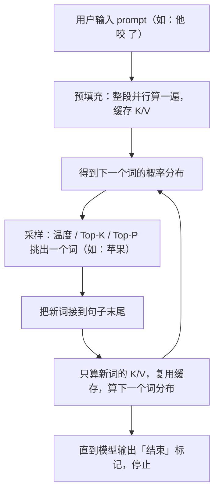

上一讲 [[【基础】Transformer训练流程]] 讲的是「训练」——整句话一次性全喂进去，用真实答案反向传播调参数。这一讲切换到「推理」——模型训练完、参数固定下来后，实际聊天时怎么把回答**一个字一个字蹦出来**。

## 1. 一句话理解

推理 = 训练好的模型，靠「预填充 → 采样 → 缓存复用」三步循环，把下一个词一个一个猜出来、串成完整回答。三个关键词：**预填充 Prefill**、**K-V 缓存**、**采样策略**。

## 2. 训练 vs 推理：先分清这是两种完全不同的跑法

训练和推理跑的虽然是同一个 Transformer，但「喂数据的方式」完全相反：

| 区别           | 训练                     | 推理                                         |
| -------------- | ------------------------ | -------------------------------------------- |
| 数据怎么进     | 整句一起进（并行算）     | 先整段 prompt 进，之后一个词一个词蹦         |
| 有没有标准答案 | 有（语料里下一个词已知） | 没有（答案要模型自己猜）                     |
| 要不要掩码     | 要（不许偷看右边答案）   | 预填充多词时要；逐词解码时可省去显式因果掩码 |
| 目标           | 调参数                   | 用固定参数生成回答                           |

关键差异在于：**推理是「自回归」**——用自己刚生出来的词，接着去预测下一个词，一个接一个。

## 3. 预填充 Prefill：整段 prompt 并行先算一遍

用户输入「他 咬 了」并回车。这三个词是「已知上下文」，模型把它们**一次性、并行**地全喂进去算（这是整个推理过程中唯一一次「整句一起进」）：

- 输入「他 咬 了」三个词 → 走完 61 个 Transformer 块 → 输出第 4 个词的概率分布（比如「苹果」概率最高）；
- **预填充仍要保持因果掩码**：虽然三个词都已知，但在并行计算时，「他」不能看右边的「咬、了」，「咬」也不能看「了」。否则前面词的表示会混入后面的词，缓存起来的 K/V 就不再是逐词生成时应有的结果。最后一个词「了」可以看完整个已知前缀，用它的输出预测第 4 个词。只有后续每次只处理一个新词时，输入中没有比它更靠右的词，才可以省去显式的因果掩码（见 [[【基础】注意力机制]] 第 6 节）。

同时，这一步顺手做了一件很重要的事：把每一层为「他」「咬」「了」算出的 **K 和 V 存进对应层的缓存**，留给后面复用（下一节）。

## 4. K-V 缓存：只算新词，复用旧词

生成出「苹果」之后，接着要预测第 5 个词。最笨的办法：把「他 咬 了 苹果」四个词重新全喂一遍。但这样每多生成一个词，就要把前面所有词从头重算一遍——越生成越慢、越费钱。

聪明做法（K-V 缓存）：

1. 每一层里，前面「他 咬 了」的 K、V 在预填充时已经算好，而且**不会被后来的词改变**；
2. 生成「苹果」时，只算「苹果」这**一个新词**的 Q、K、V；
3. 把缓存里「他 咬 了」的 K、V 取出来，加上「苹果」自己的 K、V，一起做注意力；
4. 算出第 5 个词的概率分布。

一句话：**前面词的 K、V 算一次、存起来复用；每新增一个词，只算它自己那一份。**

为什么能安全复用？每一层的 K、V 都由**该层输入的词向量**算出（$K=xW^{K}$、$V=xW^{V}$，见 [[【基础】注意力机制]] 第 3 节）。到了较深的层，这个向量已经吸收了**左边词的信息**，并非只跟这个词本身有关；但因果注意力保证它看不到右边，所以后来新增的词不会改变旧词在任何一层的输入，也不会改变旧词已有的 K、V。预填充时先按这个规则算好各层缓存，后续才能只算新词、复用旧词。实现中的缓存也按层保存 K/V，参见 [Hugging Face 的缓存说明](https://huggingface.co/docs/transformers/cache_explanation)。

> 大白话：推理不是每次从头读整句话，而是**带着「前面词的笔记」往前走**——笔记（K/V）只记一次，每写一个新词只补这一张新笔记。

## 5. 采样策略：从概率分布里挑出下一个词

现在每一步都有一张「下一个词的概率分布」（120000 个候选词、每个一个概率，softmax 算出来，见 [[Softmax详解]]）。问题来了：**怎么从这张分布里，挑出真正要蹦出来的那个词？**

- 最朴素：选概率最大的那个（贪心）。但每次都选第一名，输出会非常单调，还容易陷入重复（一直吐同一个词）。
- 所以引入「采样」：**按概率随机抽**——概率大的词更容易被抽中，但不是每次都是它。这样才有多样性。

下面三种常用策略，本质都是在调「让哪些词进抽签范围、它们的概率长什么样」：

### 5.1 温度 Temperature：调分布「尖」还是「平」

作用对象是 softmax **之前**的原始分数（logits，就是上一讲线性层吐出的那 120000 个分数）。做法：把每个 logits 都除以温度 $T$，再去做 softmax：

$$
\hat{p}_i = \frac{e^{\,z_i\,/\,T}}{\sum_{j} e^{\,z_j\,/\,T}}
$$

逐符号：

- $z_i$：第 $i$ 个候选词的原始分数（logits）；
- $T$：温度，一个正数；
- $\hat{p}_i$：第 $i$ 个词采样时用的概率。

温度怎么影响「尖」还是「平」？记住 softmax 用的是指数 $e$，指数天生会**放大分数之间的差距**：

- $T=1$：标准 softmax，不干预；
- $T<1$（如 0.5）：$z/T$ 比 $z$ 大，等于先把分数「放大」再喂指数，差距被两轮放大 → 分布更尖，高概率词更高、低概率词更低 → 输出更稳定、保守、确定；
- $T>1$（如 1.5）：$z/T$ 比 $z$ 小，分数被缩小、差距被抹平 → 分布更平，词与词概率差距缩小 → 输出更随机、多样、有创造力。

> 大白话：温度是「随机性的旋钮」。拧小（T<1）就保守、说最稳妥的话；拧大（T>1）就放得开、天马行空。

### 5.2 Top-K 采样：只留概率最高的 K 个

只从概率最高的 $K$ 个词里随机抽，其余词的采样概率直接置 0。

比如 $K=50$：先选出概率最高的 50 个词，滤掉剩下海量词汇，再在这 50 个词里按（重新归一化后的）概率采样。

为什么需要它？词表有 12 万个词，大量超低概率词单个概率极小，但架不住数量巨大——纯随机采时，它们加在一起反而容易被抽到（这就是「长尾」）。Top-K 直接把这些长尾砍掉，只在「头部」的 K 个词里抽。

### 5.3 Top-P（核采样，Nucleus Sampling）：按累积概率动态圈范围

从「累积概率达到 $P$ 的最小词集合」里采样：

- 把词按概率从高到低排好，从头开始累加概率，直到累加值第一次超过 $P$，停止；
- 只在这个「核心」子集里采样。

比如 $P=0.9$：一直累加到累积概率超过 0.9，这些词就是采样池。

它比 Top-K 更灵活，因为 **K 是固定数量、P 是动态的**：

- 分布集中时（几个词就占了 90%），采样池很小 → 输出更确定；
- 分布分散时（词很平均），要凑够 90% 得拉很多词 → 采样池很大 → 输出更多样。

这是目前最主流、效果最好的采样方式之一。

> 大白话：Top-K 是「固定只留 50 个名额」；Top-P 是「凑够 90% 的分量为止，需要几个就留几个」。

## 6. 全程串一遍：一次「蹦一个词」的完整循环

把上面三件事接起来，就是模型生成回答的完整循环：

```mermaid
flowchart TB
  A["用户输入 prompt（如：他 咬 了）"] --> B["预填充：整段并行算一遍，缓存 K/V"]
  B --> C["得到下一个词的概率分布"]
  C --> D["采样：温度 / Top-K / Top-P 挑出一个词（如：苹果）"]
  D --> E["把新词接到句子末尾"]
  E --> F["只算新词的 K/V，复用缓存，算下一个词分布"]
  F --> C
  F --> G["直到模型输出「结束」标记，停止"]
```

- 第一次（预填充）是「整段进」，之后每个新词只算它自己那份（K-V 缓存）；
- 每一步挑词都靠采样策略（温度 / Top-K / Top-P）加一点「随机性」，让回答不机械。

> 想亲眼看看推理时的注意力在干什么，可打开源文件推荐的可视化工具：[transformer-explainer](https://poloclub.github.io/transformer-explainer/)。

## 7. 总结

- **训练 vs 推理**：训练整句进、有答案、要掩码、调参数；推理先整段 prompt 做带因果约束的预填充，之后逐词解码时可省去显式因果掩码，参数固定。
- **预填充**：整段 prompt 一次性并行算，出第一个「下一个词」分布，并缓存好 K/V。
- **K-V 缓存**：前面词的 K/V 只算一次复用，每新增词只算新词那份，把「整句重算」变成「算一个」。
- **采样三件套**：温度 T（调分布尖/平）、Top-K（只留概率最高 K 个）、Top-P（按累积概率动态圈范围）——决定从分布里怎么挑下一个词。

把镜头从「单个模型怎么跑」拉远到「一个大模型在厂商手里分几个阶段被造出来」，是下一篇 [[【基础】训练阶段]]。
