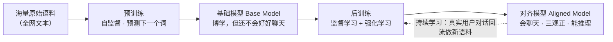

前面几讲讲的是「一个模型内部怎么跑」：第 12 讲它怎么靠「预测下一个词」被训练（[[【基础】Transformer训练流程]]），第 13 讲训练好之后怎么推理（[[【基础】推理机制]]）。这一讲把镜头拉到最远，看**厂商到底是怎么把一个大模型「造」出来的**——答案是：分阶段、一步步来，绝不是一个语料「一次训到位」。

## 1. 一句话理解

大模型的诞生走三大阶段：**预训练**（用海量原始语料把模型喂成「博学通才」，耗时最长、烧算力）→ **后训练**（花很短时间让它「会聊天、三观正、会推理、懂专业」，变成能用的助手）→ **持续学习**（上线后拿真实用户对话继续增量训练，与时俱进）。

## 2. 先看全貌：三个阶段接成一条流水线



> 预训练和后期训练之间的那张「总览图」如下（图中文字与源文件 assets 目录里的同名 excalidraw 一致）：
>
> 
>
> 图注：海量原始语料 → 预训练 → 基础模型 Base Model → 后训练 → 对齐模型 Aligned Model。

## 3. 预训练：用海量语料，喂出一个「博学通才」

### 3.1 三个特点

- **耗时最长**：通常占总计算时间的 **90% 以上**；
- **自监督学习**：数据不用人标——语料里天然带着「下一个词」当答案，模型自己跟自己学（「自」就是这意思，概念见 [[【基础】AI的分类：三大流派与机器学习入门]]）；
- **算力是主要成本**：几千张显卡烧几个月，电费就是天文数字。

这一步产出的是**基础模型 Base Model**——一个「很博学、但还不会好好聊天」的通才。

### 3.2 光靠「预测下一个词」，就长出了这些能力

奇怪的是，预训练只干一件事（猜下一个词），却能换来一大串能力。原因很简单：**语料是全网文本，语言、事实、问答、推理过程全都写在里面；模型为了把下一个词猜准，被迫把这些规律都「学会」**。结果它长出了六样本领：

| 本领                 | 大白话                           | 例子                                                                                                             |
| -------------------- | -------------------------------- | ---------------------------------------------------------------------------------------------------------------- |
| 理解语法规律         | 知道词怎么排列才算一句人话       | 能接出通顺的句子                                                                                                 |
| 感知上下文语境       | 知道同一个词在不同句子里意思会变 | 「苹果」在被咬的句子里是吃的、在手机句子里是品牌                                                                 |
| 知晓世界基本事实     | 背下了语料里反复出现的常识       | 太阳系有**八大**行星；第二次世界大战在 **1945** 年结束；Python 语言创始人是**吉多·范罗苏姆**（Guido van Rossum） |
| 有基础推理能力       | 会照着「已知规律」推出新结论     | 凡人均有一死，苏格拉底是人 → 所以苏格拉底会死                                                                    |
| 有基础模式识别能力   | 会看规律、猜下一个               | `2, 4, 6, 8, ?` → 填 `10`                                                                                        |
| 有基础上下文学习能力 | 给一段「临时规则」它能照着办     | 你告诉它「你是客服，回答问题要称用户为'宝宝'」，它回答时就会喊「宝宝」                                           |

> 但注意：这时候的模型只是「肚子有货、心里明白」，**还不会像人一样一问一答**——你跟它说「你好」，它可能接出任何文字。把「通才」变成「助手」，是下一步后训练的活。

## 4. 后训练：把「博学通才」调教成「听话的助手」

后训练和预训练比，特点完全反过来：

- **耗时很短**：几小时、几天、最多几个月（相对 90%+ 的预训练，几乎可忽略）；
- **数据与人力是主要成本**：这阶段要大量**人类标注**；
- **主要靠监督学习 + 强化学习**（不是自监督了）。

它要解决四件大事，最后产出**对齐模型 Aligned Model**：

### 4.1 学会对话格式：先学会「怎么说话」

预训练出来的模型不会聊天，后训练第一步就是拿「一问一答」的对话喂它。关键是让它看懂一套**格式符**——谁在说话、说给谁听、说到哪算完：

```
输入：
<|im_start|>system<|im_sep|>你是一个AI聊天助手，你的名字叫小蓝<|im_end|><|im_start|>user<|im_sep|>你好，你是谁？<|im_end|><|im_start|>assistant<|im_sep|>

输出：
我是小蓝<|im_end|>
```

- `<|im_start|>`：一段「角色发言」开始了，后面跟角色名（`system` 系统设定 / `user` 用户 / `assistant` 助手）；
- `<|im_sep|>`：分隔「角色」和「它说的内容」；
- `<|im_end|>`：这段发言到此结束。

模型反复见这种格式，就学会了：分清三方身份、理解每轮谁在说话、轮到自己（assistant）时该怎么接——连「我是谁、什么语气」都一起学会了。

### 4.2 竖立价值观：让模型「趋利避害」

光是会聊天还不够，还要让它知道**什么能说、什么不能说**。做法是一套「奖励」训练（RLHF）：

1. 人类标注员看模型的两个回答，对比哪个**更安全、更有用、更诚实**；
2. 拿这些「好/坏」对比，训练出一个**奖励模型**——它会给回答打分，判断好坏；
3. 用强化学习让大模型去**讨好这个打分器**：多说它判为「好」的话，少说「坏」的。

于是模型学会趋利避害——宁可少说，也不乱说危险、有害、不诚实的话。

### 4.3 能力校准：学会「承认无知」

模型预训练时被逼着「永远猜一个词」，养成了**一本正经胡说八道**的毛病（编造不存在的事，叫「幻觉」）。校准的办法：喂大量「承认无知」的问答对，教它不会就老实说不会：

> 用户：「你知道明天会发生什么吗？」
> 助手：「作为 AI，我无法预测未来，很抱歉无法回答这个问题。」

这能显著降低 AI 幻觉。

### 4.4 思维链 CoT：把推理过程「说出来」

模型直接答复杂题容易算错；让它**先输出思考过程、再给最终答案**，准确率会明显提高。这就是思维链（Chain of Thought，CoT）：

```
输入：
<|im_start|>user<|im_sep|>小明有10个苹果，他给了小红3个，又买了5个，现在他有多少个苹果？<|im_end|>
<|im_start|>assistant<|im_sep|>
<think>

输出：
开始有10个。给了小红3个，还剩 10 - 3 = 7 个。又买了5个，现在有 7 + 5 = 12 个。所以，答案是12个。
</think>
最终答案是 12。<|im_end|>
```

- `<think>`…`</think>` 之间的，是模型**说出口的思考草稿**；
- 好处：把一步到位的「盲猜」变成「一步步算」，既减少算错，也让人看得懂它怎么想的。

### 4.5 专业领域知识：定向补课

通用助手还不够，真要进某个行业（法律、医疗、编程、客服），还得再喂对应领域的专业数据做**领域训练**，让它懂行话、懂规范。

## 5. 持续学习：上线后继续「边用边学」

预训练 + 后训练做完，模型上线服务用户了。这之后还有个阶段叫**持续学习**（Continual Learning，也叫增量学习 Incremental Learning）：

- **做法**：厂商把真实用户和 AI 的对话内容，作为新语料，持续拿回去继续训练模型；
- **目的**：让模型跟上新话题、新用法、新知识，与时俱进——而不是停留在出厂那一刻。

> 大白话：预训练像「上了十几年学、拿到文凭的通才」，后训练像「入职培训 + 岗前思想教育」，持续学习则是「上岗后每天从真实工作里继续积累经验」。

## 6. 三阶段对比与总结

| 阶段     | 耗时                  | 成本大头    | 主要方法               | 用的数据                         | 产出                           |
| -------- | --------------------- | ----------- | ---------------------- | -------------------------------- | ------------------------------ |
| 预训练   | 最长（占 90%+）       | 算力        | 自监督（预测下一个词） | 海量原始语料                     | 基础模型 Base Model（博学）    |
| 后训练   | 很短（几小时~几个月） | 数据与人力  | 监督学习 + 强化学习    | 人类标注的对话/好坏对比/领域数据 | 对齐模型 Aligned Model（好用） |
| 持续学习 | 持续进行              | 数据 + 算力 | 同后训练，增量式       | 真实用户对话（需合规脱敏）       | 不断更新的大模型               |

**一句话串起来**：预训练让模型「肚子有货」，后训练让模型「会做人、会办事」，持续学习让模型「不落伍」。下次看到新闻说「某厂商发布新模型」，心里就有数了——那是这三步流水线走完的产物。
