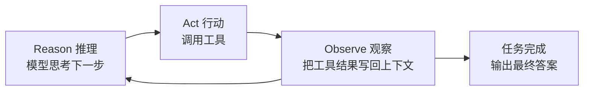

上一篇 [[【实战】封装 Tool Calling]] 已经能"模型决策 → 执行工具 → 结果回喂"，但那还只是**一次**调用。真正的 Agent 需要反复这个过程：想一想、做一步、看看结果、再想下一步，直到任务完成。这个循环就叫 **ReAct**。


## 1. ReAct 是什么

ReAct 是 **Reasoning + Acting** 的缩写，核心思想是让模型把"推理"和"行动"交替进行：



对比一下之前和现在的差别：

| 维度       | 单次工具调用       | ReAct 循环                     |
| ---------- | ------------------ | ------------------------------ |
| 工具调用   | 一轮，调完就结束   | 多轮，直到模型不再调工具       |
| 任务复杂度 | 简单（写一个文件） | 复杂（分析目录、多步操作）     |
| 上下文     | 一轮结果           | 每轮结果都累积进历史           |
| 终止条件   | 调用完工具手动结束 | 模型返回"无工具调用"即自然结束 |

一句话：**ReAct 把"调用一次工具"升级成"循环调用工具直到任务做完"**。

## 2. 从五步流水线到 while 循环

之前需要手动串五步。ReAct 把它包进一个 `query` 函数，用 `while True` 反复跑：

```python
def query(q: str, session: Session, model: Model):
    """根据用户提问进行处理"""
    session.add_message({"role": "user", "content": q})
    # ReAct Loop
    while True:
        model.invoke_stream(session)
        call_msg = registry.invoke(session.messages[-1])
        if call_msg is None:
            break
        else:
            session.messages += call_msg
```

逐行拆解这个循环：

1. `session.add_message(...)`：把用户问题追加进上下文。
2. `model.invoke_stream(session)`：模型读取完整上下文，产生回复。如果它决定调用工具，回复里就带 `tool_calls`。
3. `registry.invoke(...)`：取出并执行工具。返回值有两种：
   - `None`：模型这次**没有**调用工具，说明它认为可以给最终答案了；
   - 工具结果列表：模型要求调用工具，结果需要写回上下文。
4. `if call_msg is None: break`：**这就是 ReAct 的终止条件**——模型不再需要工具，循环结束。
5. `session.messages += call_msg`：把工具结果（`role="tool"` 的消息）追加进历史，下一轮模型就能"看到"工具执行结果，据此决定下一步。

然后调用它完成一个真实任务：

```python
query("请帮我分析./agent目录中的核心实现逻辑，将结果放到当前目录的 分析.md 中", session, model)
```

模型会先调用 `bash_command` 列目录，再反复 `read_file` 读代码，最后 `write_file` 写出分析报告——全程无需人工干预。

## 3. 配套的三处改动

为了支撑 ReAct，这一版对框架做了三处增强。

### 3.1 新增 bash_command 工具

ReAct 要"行动"，光读写文件不够，还得能执行命令。新增一个 shell 工具：

```python
import subprocess
from sys import platform

from agent.tool.core import tool


@tool(command="要执行的 bash/shell 命令")
def bash_command(command: str) -> str:
    """执行 bash/shell 命令，返回命令输出结果"""

    shell_flag = "cmd" if platform == "win32" else "/bin/bash"

    result = subprocess.run(
        command,
        shell=True,
        executable=shell_flag,
        capture_output=True,
        text=True,
        timeout=30,
    )

    if result.returncode == 0:
        return result.stdout.strip() or "(命令执行成功，无输出)"
    else:
        return f"[退出码 {result.returncode}]\n{result.stderr.strip() or result.stdout.strip()}"
```

几个设计要点：

- **平台适配**：Windows 用 `cmd`，其他系统用 `/bin/bash`。
- **超时保护**：`timeout=30`，防止命令卡死把整个 Agent 拖住。
- **结果归一**：成功返回 stdout（无输出时给一句提示），失败返回退出码 + stderr。这样无论成功失败，模型都能读到一段人类可理解的文本。
- **安全提醒**：`shell=True` 会执行任意命令，**风险极高**。生产环境必须配合沙箱、命令白名单或用户审批，绝不能把未受约束的 shell 直接暴露给模型。

注册进工具表：

```python
registry.register(read_file)
registry.register(write_file)
registry.register(bash_command)
```

### 3.2 系统提示词注入操作系统

`bash_command` 的命令要按平台区分，模型也得知道当前是什么系统，才能给出正确命令。于是在 [[【基础】系统提示词]] 的模板变量里增加 `os`：

```python
def get_os() -> str:
    return platform.system()


def render_prompt(prompt_name: str) -> str:
    template_dir = os.path.join(os.path.dirname(__file__), "prompt")
    env = Environment(loader=FileSystemLoader(template_dir))
    template = env.get_template(f"{prompt_name}.j2")
    return template.render(
        language=get_language(),
        cwd=get_cwd(),
        os=get_os(),
        is_git=get_is_git(),
    )
```

模板里对应加一行：

```markdown
# Environment

You have been invoked in the following environment:

- Primary working directory: {{ cwd }}
- Operating system: {{ os }}
- Is a git repository: {{ is_git }}
```

### 3.3 Session 自动装配提示词与工具

之前每次都要手动 `render_prompt` 和 `registry.schemas()`。现在让 `Session` 创建时自动完成：

```python
class Session:
    def __init__(self, *, system_prompt="", tools=[]):
        self.id = str(uuid.uuid4())
        self.messages: list[dict] = []
        if not system_prompt:
            system_prompt = render_prompt("system")
        self.add_message({"role": "system", "content": system_prompt})
        self.tools = tools or registry.schemas()
```

这样一来，`Session()` 一创建就自带系统提示词和全部工具 schema，调用方只需关心业务。

> 实现细节：源码里 `system_prompt` 参数最终没有被使用，而是每次调用 `render_prompt("system")` 重新渲染，属实现上的小冗余；上面按设计意图修正为使用 `system_prompt`。功能上无差别。

## 4. 精简打印输出

ReAct 会输出大量中间过程，打印器做了精简：思考只提示"思考中..."，正文用绿色流式输出，工具调用只打印工具名，不再刷屏打印完整参数。

```python
class ModelPrinterListener:

    def __init__(self, model) -> None:
        self.model = model
        self.listening = True
        events = [v for k, v in Event.__dict__.items() if not k.startswith("__")]
        for e in events:
            model.on(event=e, callback=self._model_print_callback)

    def _model_print_callback(self, e: str, **args):
        if not self.listening:
            return
        if e == Event.REASONING_START:
            print("思考中...")
        elif e == Event.REASONING_END:
            print()
        elif e == Event.CONTENT_START:
            print()
            print("内容：")
        elif e == Event.CONTENT_END:
            print()
        elif e == Event.TOOL_CALL_END:
            tool_calls = args["value"]["tool_calls"]
            for call in tool_calls:
                print(f"\033[36m调用工具：{call['function']['name']}\033[0m")
        elif e == "content":
            print(f"\033[32m{args['chunk_value']}\033[0m", end="")
        sys.stdout.flush()
```

## 5. 完整使用

```python
from agent.model import Model
from agent.printer import ModelPrinterListener
from agent.session import Session
from agent.tool import registry

session = Session()
model = Model()
listener = ModelPrinterListener(model)
session.print()

query("请帮我分析./agent目录中的核心实现逻辑，将结果放到当前目录的 分析.md 中", session, model)
session.save()
```

整个过程会自动完成：列目录 → 逐个读取源码 → 综合分析 → 写出报告。产出的报告会覆盖配置、事件系统、模型调用、会话、提示词、打印器、工具系统等模块，并总结出用到的设计模式（发布-订阅、策略、装饰器、工厂、单例）。这正是"ReAct 循环 + 工具"能自主完成多步任务的最好证明。

## 6. 最佳实践与风险

- **必须有终止保护**：`while True` 依赖模型主动停止调用工具。一旦模型陷入"反复调用同一工具"的循环，就会无限跑下去。**生产环境应加最大轮次上限**（如 `max_steps=10`），超限强制退出。
- **工具结果要可读**：无论成功失败都返回人类可读文本（如 bash 的退出码/stderr），模型才能自我纠错。
- **上下文会持续膨胀**：每轮的工具结果都累积进 `messages`，轮次越多 token 消耗越大，必要时要做上下文压缩。
- **安全第一**：`bash_command` 的 `shell=True` 等于把命令行交给模型，务必配合沙箱与审批机制。

## 7. 总结

- **ReAct = Reasoning + Acting**：让模型"思考 → 行动 → 观察"循环往复，直到任务完成。
- **核心实现**：一个 `while True` 循环，模型调工具就把结果写回上下文再来一轮，不调工具就退出。
- **三处增强**：新增 `bash_command` 工具、系统提示词注入操作系统、`Session` 自动装配提示词与工具。
- **关键约束**：加最大轮次、结果可读、注意上下文膨胀与 shell 安全。

现在 Agent 已经能自主完成多步任务了。但 `query` 还是我们手动调用的一次函数，下一步是把它抽象成一个**独立的 Agent 类**，让"提问 → 自主循环 → 返回答案"成为对象自身的职责。
