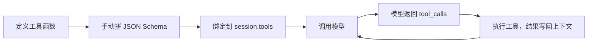

前面 [[【基础】会话管理]] 让模型能记住上下文，但它有个硬限制：**大模型只能"文本进、文本出"**，本身没有任何其他功能。可 Agent 应用经常需要：读/写文件、执行命令、联网搜索……这些模型都做不到。

解决办法就是 **Tool Calling（工具调用）**：让模型"说出"它想调用哪个工具、参数是什么，然后由**我们自己的代码**去真正执行，再把结果喂回给模型。模型负责决策，代码负责执行。

## 1. Tool Calling 的整体流程

完整链路分五步：



下面按这个顺序一步步实现。流程图对应的示意图：


## 2. 定义工具函数

工具本质就是普通的 Python 函数。先定义两个最基础的文件操作：

```python
def read_file(filepath: str) -> str:
    """读取文件内容并以字符串形式返回"""
    with open(filepath, "r", encoding="utf-8") as f:
        return f.read()


def write_file(filepath: str, content: str) -> None:
    """将内容写入文件"""
    with open(filepath, "w", encoding="utf-8") as f:
        f.write(content)
```

先本地测一下，确认函数本身没问题：

```python
content = read_file("./agent/prompt/system.j2")
print(content[:200])
```

## 3. 绑定工具到上下文

函数写好了，模型并不知道它存在。需要把这个函数的**说明书**（JSON Schema）交给模型。描述规范参考 https://api-docs.deepseek.com/zh-cn/api/create-chat-completion 。

每个工具的 schema 结构固定：

```python
session.tools = [
    # 工具1: 读文件
    {
        "type": "function",          # 固定为 function
        "function": {
            "name": "read_file",     # 工具名称，会影响模型输出结果，通常为函数名
            "description": "读取文件", # 自然语言描述，模型靠它判断何时调用
            "parameters": {
                "type": "object",    # 固定为 object
                "properties": {
                    "filepath": {
                        "type": "string",
                        "description": "文件的绝对路径，或相对于cwd的路径",
                    }
                },
                "required": ["filepath"]  # 必填参数
            }
        }
    },
    # 工具2: 写文件
    {
        "type": "function",
        "function": {
            "name": "write_file",
            "description": "写入文件",
            "parameters": {
                "type": "object",
                "properties": {
                    "filepath": {
                        "type": "string",
                        "description": "文件的绝对路径，或相对于cwd的路径",
                    },
                    "content": {
                        "type": "string",
                        "description": "要写入的内容，该内容会完全覆盖文件原本内容"
                    }
                },
                "required": ["filepath", "content"]
            }
        }
    }
]
```

三个字段的含义要记牢：

- `name`：工具名，模型返回时用它指代要调用的工具，**会影响模型输出结果**，通常直接取函数名。
- `description`：自然语言描述，模型靠它判断"这个工具是干什么的、什么时候该用"。
- `parameters`：参数的 JSON Schema，告诉模型每个参数叫什么、什么类型、必填与否。

## 4. 模型看到的上下文长什么样

你传给模型的是结构化 JSON，但模型厂商在底层会把它**转写成一段文本，拼在系统上下文的末尾**。大致长这样：

```markdown
<|im_start|>system<|im_sep|>
系统提示词

# Tools

## functions

namespace functions {
// 读取文件
type read_file = ({
// 文件的绝对路径，或相对于cwd的路径
file_path: string
}) => any;
// 写入文件
type write_file = ({
// 文件的绝对路径，或相对于cwd的路径
file_path: string;
// 待写入的内容
content: string
}) => any;
}
<|im_end|>
<|im_start|>user<|im_sep|>
用户消息
<|im_end|>
```

也就是说，工具定义被当成"系统提示词的一部分"喂进去，所以模型天然知道有哪些工具可用。

当模型决定调用工具时，它返回的不再是普通文本，而是带 `<tool_call>` 标记的内容：

```text
思考内容
</think>
<tool_call>
{"name": "write_file", "arguments": {"file_path": "..."}}
</tool_call>
<|im_end|>
```

## 5. 让模型发起工具调用

先暂时关掉流式打印，发起一个需要写文件的请求：

```python
listener.listening = False  # 暂时不监听流式输出

session.add_message({"role": "user", "content": "请在当前目录新建一个`uv.md`文件，写入UV的安装教程。直接新建就好"})
resp = model.invoke(session)
print(resp.print_raw())
```

模型不会真的写文件，它只会**告诉你它想调用 `write_file`**，并给出参数。

## 6. 解析并执行工具

模型的回复存在 `session.messages[-1]`，里面带着 `tool_calls` 字段。把它解析出来：

```python
import json

msg = session.messages[-1]
tool_calls = msg["tool_calls"][0]
tool_id = tool_calls["id"]
tool_name = tool_calls["function"]["name"]
arguments = json.loads(tool_calls["function"]["arguments"])

print("tool id", tool_id)
print("tool name", tool_name)
print("arguments", arguments)
```

参数是 JSON **字符串**，要 `json.loads` 解析成字典。拿到工具名后，就可以从当前作用域找到对应函数并执行：

```python
func = globals().get(tool_name)
if callable(func):
    func(**arguments)
```

到这里，工具就真正执行了——文件被创建出来。

## 7. 流式场景下的 Tool Call 解析

上面用的是非流式 `invoke`，处理简单。但真实应用多用流式（打字机效果），而**流式返回的 tool_calls 是碎片化的**：一个工具调用的 id、name、arguments 可能分散在多个 chunk 里，需要边收边拼。为了优雅地处理这件事，这里引入一套**事件系统**。

### 7.1 事件类型与事件发射器

先定义所有事件名，再实现一个极简的发布/订阅器：

```python
from collections import defaultdict
from collections.abc import Callable
from dataclasses import dataclass, field
from typing import Any


class Event:
    REASONING_START = "reasoning_start"
    REASONING = "reasoning"
    REASONING_END = "reasoning_end"
    CONTENT_START = "content_start"
    CONTENT = "content"
    CONTENT_END = "content_end"
    TOOL_CALL_START = "tool_call_start"
    TOOL_CALL = "tool_call"
    TOOL_CALL_END = "tool_call_end"
    COMPLETE = "complete"


@dataclass
class EventEmitter:
    _listeners: dict[str, list[Callable[..., Any]]] = field(
        default_factory=lambda: defaultdict(list)
    )

    def on(self, event: str, callback: Callable[..., Any]) -> None:
        self._listeners[event].append(callback)

    def emit(self, event: str, **data: Any) -> None:
        for cb in self._listeners.get(event, []):
            cb(event, **data)
```

`on` 注册回调，`emit` 触发事件并把数据传给所有回调。这套机制让"解析流"和"怎么展示流"解耦——解析器只管发事件，打印器/渲染器只管监听。

### 7.2 用 Builder 分别拼装三类内容

流式响应里有三类内容：思考（reasoning）、正文（content）、工具调用（tool_calls）。为每类各写一个 Builder，用同一个模板处理"开始事件 → 逐块累积 → 结束事件"：

```python
from abc import ABC, abstractmethod


def _get_reasoning_field_name(res_or_chunk):
    """为了兼容性，获取推理字段的名称"""
    for attr_name in ["reasoning_content", "reasoning"]:
        if hasattr(res_or_chunk, attr_name):
            return attr_name
    return ""


class Builder(ABC):

    def __init__(self, emitter: EventEmitter):
        self.emitter = emitter
        self.value = None
        self.compoleted = False

    @abstractmethod
    def _key_names(self, delta) -> list[str]:
        """获取关键名称"""
        pass

    def emit(self, chunk):
        if self.compoleted:
            return
        if not chunk.choices:
            return
        delta = chunk.choices[0].delta
        field_name, start_event_name, event_name, end_event_name = self._key_names(delta)
        value = getattr(delta, field_name, None)
        if value:
            if not self.value:
                self.value = {field_name: value}
                self.emitter.emit(start_event_name)
            else:
                self.append_value(value, field_name)
            self.emitter.emit(event_name, chunk_value=value, chunk=chunk)
        if self.is_end(chunk):
            if self.value:
                self.emitter.emit(end_event_name, value=self.value, chunk=chunk)
                self.compoleted = True

    def append_value(self, value, field_name: str):
        self.value[field_name] += value

    def is_end(self, chunk):
        return bool(chunk.choices[0].finish_reason)


class ContentBuilder(Builder):
    def _key_names(self, delta):
        return ["content", Event.CONTENT_START, Event.CONTENT, Event.CONTENT_END]


class ReasoningBuilder(Builder):
    def _key_names(self, delta):
        return [
            _get_reasoning_field_name(delta),
            Event.REASONING_START,
            Event.REASONING,
            Event.REASONING_END,
        ]

    def is_end(self, chunk):
        delta = chunk.choices[0].delta
        return bool(delta.content) or bool(delta.tool_calls) or super().is_end(chunk)
```

`ContentBuilder` 和 `ReasoningBuilder` 直接复用父类的"字符串拼接"逻辑即可。真正麻烦的是工具调用——它的增量是**按索引拼接**的：每个 chunk 可能只带来某个工具调用的 id、或 name、或一段 arguments 碎片，需要按 `index` 归位并累加：

```python
class ToolCallsBuilder(Builder):
    def _key_names(self, delta):
        return ["tool_calls", Event.TOOL_CALL_START, Event.TOOL_CALL, Event.TOOL_CALL_END]

    def emit(self, chunk):
        super().emit(chunk)
        if self.value:
            self._normalize_tool_calls()

    def _normalize_tool_calls(self):
        tool_calls = self.value["tool_calls"]
        for i in range(len(tool_calls)):
            if not isinstance(tool_calls[i], dict):
                tc = tool_calls[i]
                func_obj = getattr(tc, "function", None)
                tool_calls[i] = {
                    "id": getattr(tc, "id", None) or "",
                    "type": getattr(tc, "type", None) or "function",
                    "function": {
                        "name": getattr(func_obj, "name", None) or "",
                        "arguments": getattr(func_obj, "arguments", None) or "",
                    },
                }

    def append_value(self, value, field_name: str):
        tool_calls = self.value[field_name]
        for tc_delta in value:
            idx = tc_delta.index
            while len(tool_calls) <= idx:
                tool_calls.append(
                    {
                        "id": "",
                        "type": "function",
                        "function": {"name": "", "arguments": ""},
                    }
                )
            tc = tool_calls[idx]
            if delta_id := getattr(tc_delta, "id", None):
                tc["id"] = delta_id
            if delta_type := getattr(tc_delta, "type", None):
                tc["type"] = delta_type
            if delta_func := getattr(tc_delta, "function", None):
                if name := getattr(delta_func, "name", None):
                    tc["function"]["name"] = name
                if args := getattr(delta_func, "arguments", None):
                    tc["function"]["arguments"] += args
```

核心是 `append_value`：按 `index` 找到对应槽位，id/type/name 直接覆盖，arguments 用 `+=` 逐段累加。这样无论碎片怎么切，最后都能拼成一个完整、可解析的 tool call。

### 7.3 打印器监听事件

有了事件，打印器只需注册回调，就能自动展示思考、正文和工具调用：

```python
class ModelPrinterListener:

    def __init__(self, model) -> None:
        self.model = model
        self.listening = True
        events = [v for k, v in Event.__dict__.items() if not k.startswith("__")]
        for e in events:
            model.on(event=e, callback=self._model_print_callback)

    def _model_print_callback(self, e: str, **args):
        if not self.listening:
            return
        if e == Event.REASONING_START:
            print("思考：")
        elif e == Event.REASONING_END:
            print()
        elif e == Event.CONTENT_START:
            print()
            print("内容：")
        elif e == Event.TOOL_CALL_START:
            print()
            print("工具调用：")
        elif e == Event.TOOL_CALL_END:
            print(json.dumps(args["value"], indent=2, ensure_ascii=False))
        elif e == Event.REASONING:
            print(f"\033[36m{args['chunk_value']}\033[0m", end="")
        elif e == "content":
            print(f"\033[32m{args['chunk_value']}\033[0m", end="")
        sys.stdout.flush()
```

## 8. 总结

- **为什么需要**：模型只能文本进出，读写文件/执行命令/联网都要靠外部代码执行。
- **五步流程**：定义函数 → 拼 JSON Schema → 绑定 `session.tools` → 调用模型 → 执行返回的 `tool_calls`。
- **Schema 三要素**：`name`（影响输出）、`description`（决定何时调用）、`parameters`（参数定义）。
- **流式难点**：tool_calls 是碎片化的，用事件系统 + Builder 按索引拼接，才能得到完整调用。

现在这套流程能用，但**太啰嗦**：每个工具都要手写一大段 JSON Schema，工具一多就难维护。下一篇 [[【实战】封装 Tool Calling]] 用 Pydantic 把它封装成 `Tool` 类和 `@tool` 装饰器。
