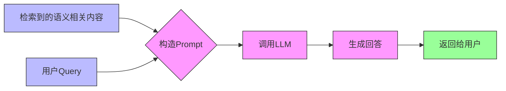

## 1. 基本介绍

RAG，全称 Retrieval-Augmented Generation，中文：检索增强生成

核心思想：为大模型补充来自于外部的相关数据与上下文，从而帮助大模型生成更丰富、更准确、更可靠的内容。

也就是 **临时给大模型外挂一个知识库**。


解决的问题：

1. 受限于已有知识库，无法快速新增语料信息
2. 重新训练大模型需要很长的时间

**案例**

开发一个在线的自助产品咨询工具，允许客户使用自然语言进行交互式的产品问答。

假设我们的产品是：香蕉手机

```
请介绍一下您公司这款产品（香蕉手机）与XX产品的不同之处
```

为了让客户有更好的体验，决定使用大模型来构造这样的咨询功能并将其嵌入到公司的官方网站。

如果你直接使用通用大模型，那么结果可能是：

1. 大模型回答：我不知道什么是香蕉手机
2. 大模型胡编乱造一段回答（大模型幻觉）

【RAG技术之前的解决方案】

将公司资料作为提示词的一部分，如下图：


🤔 思考：存在什么问题？

如果需要外挂的知识库内容非常的多（例如一本小说几十万字），那么通过这种方式提供给大模型，大模型也不能精确的找到答案。

## 2. 经典架构

简单的 RAG 应用从整体上分为两个阶段：

1. 数据索引（Data Indexing）
2. 数据查询（Query）3. 检索（Retrieval）4. 生成（Generation）

### 2.1 数据索引

在做数据索引时，通常分为这么几个步骤：

1. 加载文档
2. 切分成 chunks
3. 转化为向量嵌入
4. 存入向量数据库


**切分成chunks**

对输入的文档进行分割，分割成一个一个知识块（Chunk），从而为后续嵌入做准备。

1. 语义结构维度：强调的是**语义完整性**，防止模型拿到“断句、不完整”的上下文。

   可以按照句子的粒度进行切割，将每一段文本按句号、问号、叹号等 **标点符号** 分割。

   原文

   ```
   ChatGPT 是由 OpenAI 开发的大语言模型。它基于 Transformer 架构，具有强大的语言理解和生成能力。
   ```

   切割后

   ```
   ChatGPT 是由 OpenAI 开发的大语言模型。
   ```

   ```
   它基于 Transformer 架构，具有强大的语言理解和生成能力。
   ```

2. 实现策略维度：满足向量模型有最大词元限制，比如 OpenAI embedding 最大约 8192 词元数。3. 固定长度字符切分：每 N 字符为一段，适合规则性较强的文档 4. 词元切分：每 N 个词元切一段，兼容模型的词元数限制

上面这两个策略可以组合着来使用。

**转为向量**

将每个 chunk 转换为一个“高维向量”，用来表达其语义。

每个向量通常是一个长度为 1536 或 768 的浮点数数组，例如：

```js
[0.112, -0.045, 0.203, ..., 0.087]  // 一个 chunk 的语义向量
```

**存入向量数据库**

一般会存储在功能全面的 **向量数据库** 里面，向量数据库会提供强大的向量检索算法与管理接口，这样可以很方便地对输入问题进行 **语义检索**。

常见向量数据库：

| 向量库            | 特点                       |
| ----------------- | -------------------------- |
| Supabase          | PostgreSQL + pgvector 扩展 |
| Weaviate          | 云服务 + 本地部署均可      |
| Pinecone          | 高性能、易接入             |
| Milvus            | 海量数据、高性能搜索       |
| MemoryVectorStore | 纯 JS 内存向量库（测试用） |

### 2.2 数据查询

数据查询阶段的两大核心阶段是 **检索** 与 **生成**。


**检索阶段**

分为下面几个步骤：

1. 将 Query（用户的问题） 转化为向量
2. 在向量数据库中进行相似度检索（语义检索），相似度的检索，有几种方式3. **余弦相似度** 4. 欧氏距离 5. 点积

3. 为生成阶段准备检索结果

**生成阶段**



构造出来的提示词大致如下：

```
[系统提示]：
你是一个智能客服助手，请基于以下资料回答用户的问题。

[资料内容]：
1. 本产品支持7天无理由退货。
2. 如存在质量问题，可申请退换货。
3. ...

[用户问题]：
我买的这个产品坏了还能退吗？

[你的回答]：
```

**完整的流程**


---

-EOF-
